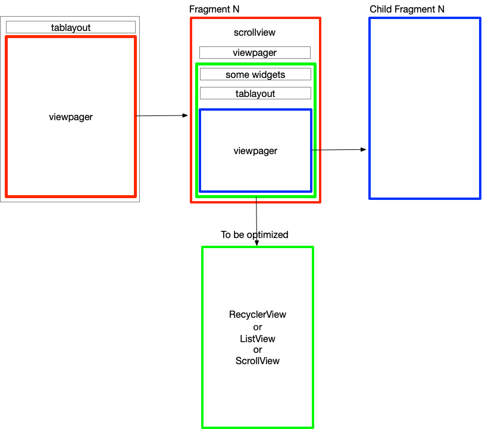

External libraries：
=====

Gson: 

It can be used to convert a JSON string to an equivalent Java object。

Glide: Glide is a fast and efficient open source media management and
image loading framework for Android that wraps media decoding, memory
and disk caching, and resource pooling into a simple and easy to use
interface.

OKHttp: 

Still under maintenance，Easy to use

Design:
===== 
MVP mode

TODO
=====
1.banner animation

2.Rate move fragment
