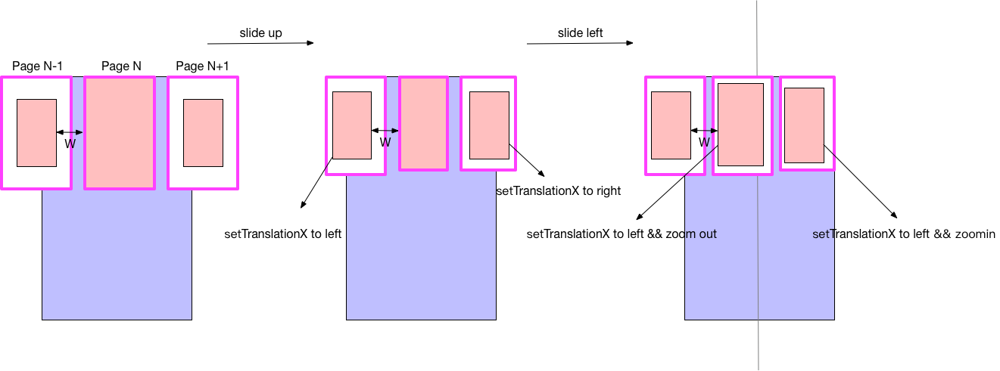

External libraries：
=====

Gson: 

It can be used to convert a JSON string to an equivalent Java object。

Glide: Glide is a fast and efficient open source media management and
image loading framework for Android that wraps media decoding, memory
and disk caching, and resource pooling into a simple and easy to use
interface.

OKHttp: 

Still under maintenance，Easy to use

Design:
===== 
MVP mode

Animation
===== 

  

step-1:  

step-1完成情况:  
100%
step-2完成情况:  
0%，未开始，基本原理与step-1的相同  
step-3完成情况:  
0%，未开始，基本原理与step-1的相同

Get Apk
=====
https://pan.baidu.com/s/1sZ44fzXJ3SN8mC3L0v7L2Q
