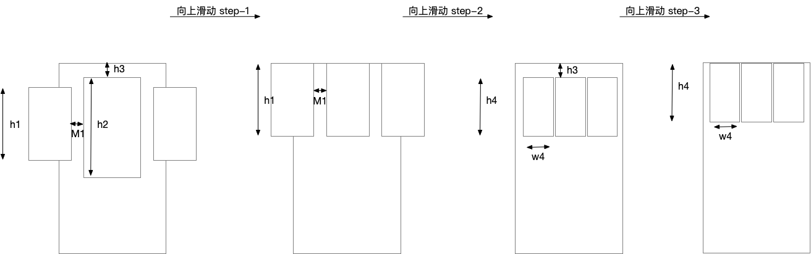

Desc:
这是一道外企的面试作业题，需要实现要求的效果，给定的期限是一个星期，我在三到四个工作日完成了，期间不仅要完成繁重的开发任务，还要抽出时间做这个，体现了我的高效^^(令我惊讶的是，上一年我提交90000行代码，代码贡献量位居团队第一）。
很幸运，我最后拿到offer，但由于一些家庭原因没有去入职，我很遗憾！说起来，我非常喜欢各位面试官和HR以及招聘顾问，他们和善、专业、包容、有深度，和他们交流让我很快乐，整个过程充满新鲜感，与我所接触过的公司和人都不一样，我特别期待加入他们，与他们共事。之前由于家庭的原因让我暂时放弃加入他们的机会，现在一切归于平稳了，如果有机会，我想再次尝试和他们接触。
这是我第一次在github上表露内心世界，也许没人会注意到，但今夜思考人生之时，我不知为何有将一些思想的碎片记录于此的念头并付诸于行动，是源于对现实的不满？

External libraries：
=====

Gson: 

It can be used to convert a JSON string to an equivalent Java object。

Glide: Glide is a fast and efficient open source media management and
image loading framework for Android that wraps media decoding, memory
and disk caching, and resource pooling into a simple and easy to use
interface.

OKHttp: 

Still under maintenance，Easy to use

Design:
===== 
MVP mode

Animation
===== 

  

step-1:  

step-1(80%工作量)完成情况:  
100%  
step-2(10%工作量)完成情况:  
0%，未开始，基本原理与step-1的相同  
step-3(10%工作量)完成情况:  
0%，未开始，基本原理与step-1的相同

Get Apk
=====
https://pan.baidu.com/s/1sZ44fzXJ3SN8mC3L0v7L2Q
